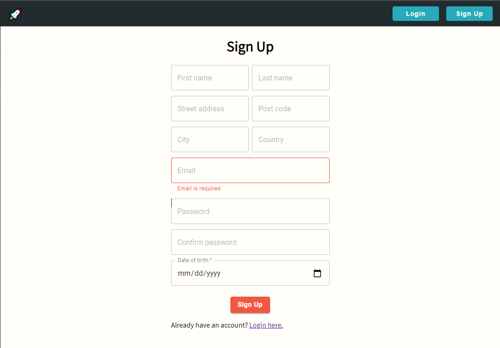
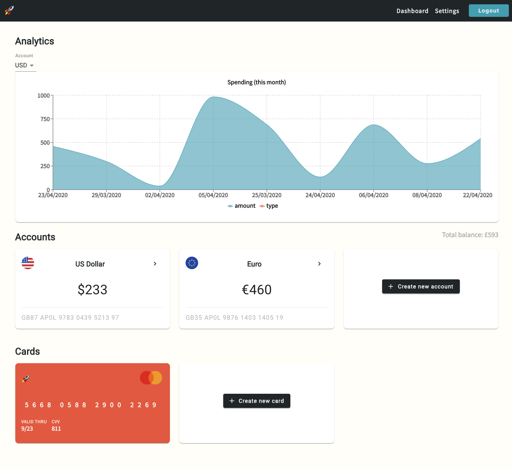

# apollobank 🚀

A fullstack GraphQL banking application built using React, Node & TypeScript.

🔥Any contribution activity including finding/report/fixing issues, and pull requests are Welcome!👋 Now it is fully open source!👨 <br/>
Check the contribution guide [here](CONTRIBUTING.md).

## Running

### Prerequirement
- Node.js
- PostgreSQL 13
  - create database name "apollobank"
- Git clone
```bash
git clone https://github.com/edwardcdev/apollobank.git
cd apollobank
```

### Run backend
```bash
cd server
npm install
npm start
```
- check ormconfig.json file to check or update database connection info.

### Run frontend
```bash
cd client
npm install
npm start
```
- It will server at http://localhost:3000/


### Using
- Register fist.

- And then login.

- Add account and transaction! Play it!


## Functions

- Login/register
- Dashboard
- Accounts
- Transactions
- Credit cards
- Settings
- Spending for this month chart
- Dummy data generator using faker

## Tech Stack

### Server side

- Apollo Server
- bcryptjs
- cors
- Express
- GraphQL
- faker
- jsonwebtoken
- TypeGraphQL
- TypeORM
- TypeScript
- PostgreSQL

### Client side

- Apollo React Hooks
- FontAwesome Icons
- Material UI
- Recharts
- Formik
- Yup

## Todo

- [ ] Don't allow the user to destroy an account if they are in debt or their account balance > 0
- [ ] When deleting and destroying an account, alert the user with another dialog to check if they would like to proceed with this action.
- [ ] Update the chart on the dashboard to show spending such that the y axis is the users account balance.
- [ ] Sort transactions by date & sort chart data by date.
- [ ] Fetch exchange rates from an API.
